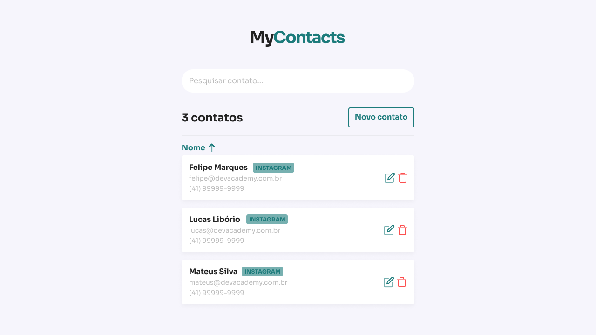
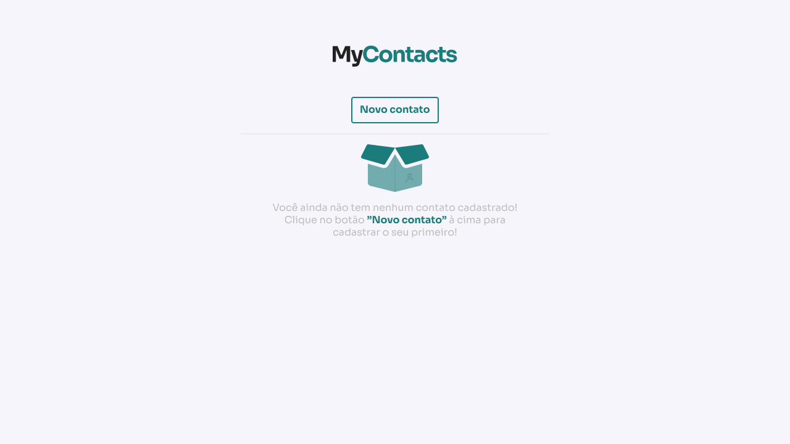

<h1 align="center">
  
</h1>

<h4 align="center"> 
	🚧 em construção... 🚧
</h4>

## 💻 Sobre o projeto

MyContacts - Um aplicativo para salvar e organizar seus contatos.

Projeto desenvolvido durante o curso Jstack
O JStack é um curso de Node.js, React, React Native e TypeScript focado em te preparar para o mercado e ensinar de verdade como essas tecnologias funcionam.

## 🎨 Layout

O layout da aplicação está disponível no Figma:

<a href="https://www.figma.com6">
 🚧 Layout em construção... 🚧
</a>

### Web

  

  

## 🛠 Tecnologias

As seguintes ferramentas foram usadas na construção do projeto:

- [Express]
- [Node.js]
- [React]
- [Styled Components]
